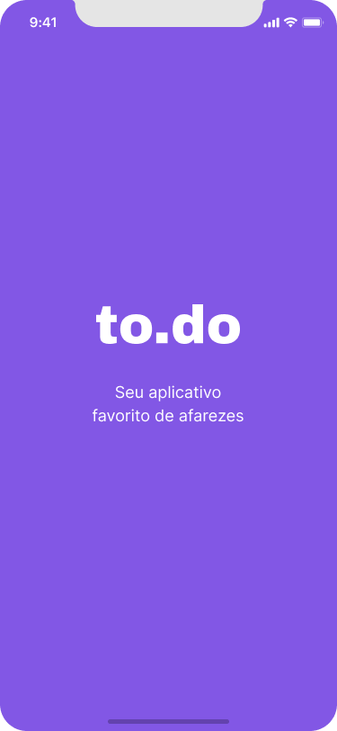

# ToDo List mobile feita usando React Native
## Primeiro desafio da trilha de React Native da Rocketseat

## Tecnologias utilizadas
- React Native
- Typescript

## Funcionalidades da aplicação
- Contagem de tarefas;
- Adicionar uma nova tarefa;
- Remover uma tarefa;
- Marcar e desmarcar uma tarefa como concluída.

## Splash 

## Tela Home 

## Extra milhas
- [x] Exibir alerta ao tentar adicionar uma tarefa com o mesmo nome
- [x] Exibir alerta pedindo confirmação ao remover um todo
- [x] Edição todo

## Design da aplicação
- [Figma](https://www.figma.com/file/O6uk4yXxpFYtI0EiSA3629/to.do-(Copy)?node-id=10485%3A499)